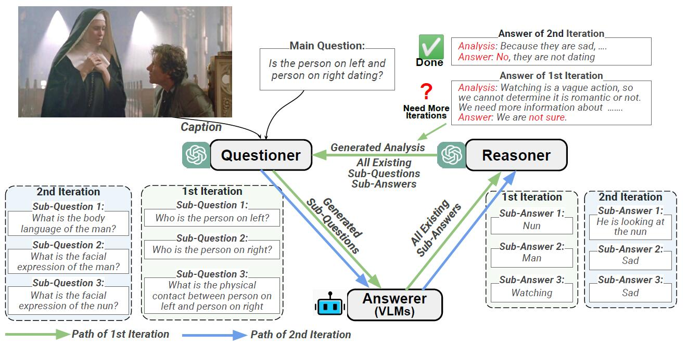

# IdealGPT: Iteratively Decomposing Vision and Language Reasoning via Large Language Models.

[Haoxuan You*](https://hxyou.github.io/), [Rui Sun*](https://www.linkedin.com/in/rui-sun-three/), [Zhecan Wang*](https://www.zhecanwang.com/), [Long Chen](https://zjuchenlong.github.io/), [Gengyu Wang](http://wanggengyu.com/), [Hammad A. Ayyubi](https://hammad001.github.io/), [Kai-Wei Chang](http://web.cs.ucla.edu/~kwchang/), [Shih-Fu Chang](https://www.ee.columbia.edu/~sfchang/)

[*: equal contribution]

[Paper](https://arxiv.org/pdf/2305.14985.pdf)



## Contents

+ [Installation](#installation)
+ [Dataset](#dataset)
+ [Run](#run)
+ [Evaluation](#evaluation)
+ [Cite](#cite)

## Installation

Clone our repository and create a new python environment via the follwing command
```
git clone https://github.com/Hxyou/IdealGPT.git
cd IdealGPT
conda env create -f environment.yml
conda activate idealgpt
```

If you would like to use [LLaVA](https://github.com/haotian-liu/LLaVA) and [MiniGPT4](https://github.com/Vision-CAIR/MiniGPT-4) to solve sub-questions, please install them as mentioned in their repository.

## Dataset

In our paper, we conduct experiments on [SNLI-VE](https://github.com/necla-ml/SNLI-VE) and [VCR](https://visualcommonsense.com/). Please refer to their website to see how to download the data.

## Run

> NOTE: 1. If you would like to run our code, please replace the filepath with yours. 2. You need to configure an OpenAI key to use OpenAI API. More details can be found at [OpenAI platform](https://platform.openai.com/)

In order to save money and running time, you can randomly select 500 samples from the val/dev split of VCR and SNLI-VE at first. (dataset can be vcr_val or ve_dev)

```
cd misc
python sample_data.py --dataset=vcr_val
cd ..
```

Then, you can use IdealGPT to do inference. Here is an example of zero-shot VCR.
```Shell
python blip_gpt_main.py  \
    --data_root=/your/dataset/path \
    --exp_tag=vcr_05241522 \
    --dataset=vcr_val \
    --device_id=0 \
    --prompt_setting=v1a \
    --data_partition=0_499 \
    --vqa_model=blip2_t5_xl  \
    --temp_gpt=0.0  \
    --data_subset=/your/selected/data/subset/path \
    --openai_key=<your_openai_key>
```
You can replace vcr_val with ve_dev to obtain SNLI-VE results.

## Evaluation
We employ accuracy to evaluate zero-shot performance on VCR and SNLI-VE.

1. VCR
```
python vcr_eval.py --result=[path of saved VCR result folder, named by exp_tag in run]
```

2. SNLI-VE
```
python ve_eval.py --result=[path of saved VCR result folder, named by exp_tag in run]
```

## Cite
If you are interested in our work, please cite the paper as
```
@misc{you2023idealgpt,
      title={IdealGPT: Iteratively Decomposing Vision and Language Reasoning via Large Language Models}, 
      author={Haoxuan You and Rui Sun and Zhecan Wang and Long Chen and Gengyu Wang and Hammad A. Ayyubi and Kai-Wei Chang and Shih-Fu Chang},
      year={2023},
      eprint={2305.14985},
      archivePrefix={arXiv},
      primaryClass={cs.CV}
}
```